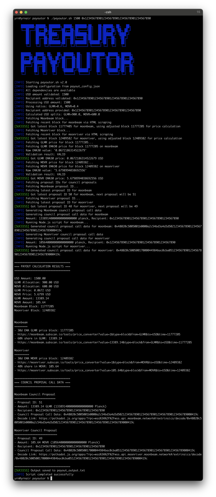

# Moonbeam Treasury Council's `payoutor v2` 

## Overview

`payoutor.sh` is a Bash script designed to make life easier for members of the **Moonbeam Treasury Council** by automating the calculation of GLMR and MOVR token Treasury payouts at current prices based on the requested amount in USD and by generating the specific treasury proposals extrinsic call data from that. 




## Features

- **Automated payout calculation** for GLMR and MOVR based on a USD input, current 30d EMA token prices and their split ratio
- **Fetches recent block numbers** for both networks (with offset for Subscan 30d EMA price stability)
- **Extracts 30d EMA price** for the exact block from Subscan's price converter tool
- **Generates extrinsic call data** for the treasury proposal on both Moonbeam and Moonriver
- **Fetches latest proposal IDs** from both networks for council proposals
- **Real-time progress logging** during council proposal generation
- **Customizable config file** for adjusting token payout ratios, proxy address, RPC's etc.
- **Multiple output formats** (terminal, txt, JSON, Markdown)


## Requirements

- Bash (tested on macOS, should work on Linux)
- `curl` (for HTTP requests)
- `awk`, `bc`, `grep`, `sed`
- `jq` (optional; for config file parsing)
- Node.js (for council proposal call data generation)

Install missing dependencies on macOS with Homebrew:

```sh
brew install curl jq bc node
```

## Installation

1. Place `payoutor.sh` in your working directory.

2. Make it executable:
   
   ```sh
   chmod +x payoutor.sh
   ```

3. (Optional) Create or edit `payout_config.json` for custom ratios, a proxy address and more.

## Usage

```sh
./payoutor.sh <USD_AMOUNT> [RECIPIENT_ADDRESS] [OPTIONS]
```

### Arguments

- `<USD_AMOUNT>`: The total payout amount in USD (e.g., `1000`, `1500.50`)


### Examples

```sh
# Basic payout calculation
./payoutor.sh 1000

# With recipient address
./payoutor.sh 1000 0x1234567890123456789012345678901234567890

# With proxy call data using address from config
./payoutor.sh 1000 0x1234567890123456789012345678901234567890 --proxy

# With proxy call data using a specific proxy address
./payoutor.sh 1000 0x1234567890123456789012345678901234567890 --proxy-address 0x41D4B02022165Fcd47b4E0F64Aa41eEF9ef1da38
```

## Configuration

You can use a JSON config file (default: `payout_config.json`) to set custom payout ratios, specify the proxy address for repeated usage and more:

```json
{
  "glmr_ratio": 0.6,
  "movr_ratio": 0.4,
  "retry_attempts": 3,
  "timeout": 30,
  "block_age_minutes": 5,
  "council_threshold": 3,
  "council_length_bound": 10000,
  "websocket_endpoints": {
    "moonbeam": "wss://wss.api.moonbeam.network",
    "moonriver": "wss://wss.api.moonriver.moonbeam.network"
  },
  "proxy_address": "0x1234567890123456789012345678901234567891"
} 
```

## Proxy Features
- `--proxy` enables output of proxy council proposal call data for both Moonbeam and Moonriver.
- `--proxy-address <address>` specifies the proxy address to use for proxy call data.
- If `--proxy` is set but no address is specified, the proxy address will be loaded from the `proxy_address` field in `payout_config.json`.
- If neither is set, proxy call data is not output.

## Options

- `-h, --help`           Show help message
- `-v, --verbose`        Enable verbose output (debug/logging)
- `-c, --config FILE`    Use a custom configuration file (default: payout_config.json)
- `-o, --output FILE`    Specify output file (default: payout_output.txt)
- `-l, --log FILE`       Specify log file (default: payout.log)
- `--glmr-ratio RATIO`   Set GLMR allocation ratio (default: 0.6)
- `--movr-ratio RATIO`   Set MOVR allocation ratio (default: 0.4)
- `--version`- `-h, --help`                Show help message
- `-v, --verbose`             Enable verbose output
- `-d, --dry-run`             Show calculations without making API calls
- `-c, --config FILE`         Use custom configuration file
- `-o, --output FILE`         Specify output file (default: payout_output.txt)
- `-l, --log FILE`            Specify log file (default: payout.log)
- `--glmr-ratio RATIO`        GLMR allocation ratio (default: 0.6)
- `--movr-ratio RATIO`        MOVR allocation ratio (default: 0.4)
- `--council-threshold N`     Council threshold (default: 3)
- `--council-length-bound N`  Length bound (default: 10000)
- `--moonbeam-ws URL`         Moonbeam WebSocket endpoint
- `--moonriver-ws URL`        Moonriver WebSocket endpoint
- `--json`                    Output results in JSON format
- `--markdown|--md-table`     Output results in Markdown table format
- `--proxy`                   Output proxy council proposal call data in addition to normal call data
- `--proxy-address ADDR`      Specify proxy address (overrides config)
- `--version`                 Show version information            Show version information

## Output

- Results are printed to the terminal _and_ saved to the output file (default: `payout_output.txt`).
- Log messages are saved to the log file (default: `payout.log`).


## Troubleshooting

- **Missing dependencies:** The script will alert you if required tools are missing.
- **API/network errors:** If Subscan is unreachable or the price is unavailable for a block, the script will retry and log errors.
- **Locale issues:** The script forces `LC_NUMERIC=C` for all calculations to avoid decimal/comma confusion.
- **No EMA30 price for block:** The script uses a recent block (latest - 200) to ensure a valid, scrapable EMA30 price from Subscan. If you need a different block, adjust the offset in the script.


---

For questions or improvements, contact the MBTC Team in the [Moonbeam Forum](https://forum.moonbeam.network/) or open an issue in the project repository. 
